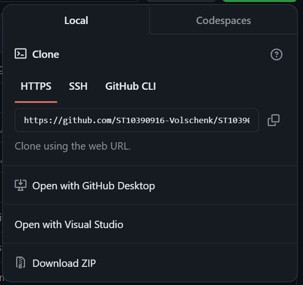
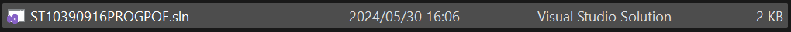
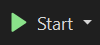

##ST10390916 PROG POE PART 2

The following improvements were made based on the feedback from Part 1:
 - Coloured text has been added to highlight messages users need to look at.
 - The conversion from tablespoons to cups and vise versa has been added.
 - The amount of comments were increased to describe what different parts of the application is for.
 - More references were added for the parts I had done research on.
 - The readme is also improved with detailed instructions on how to run the project.

#How to run the project:
 1. Go to the following GitHub repository: https://github.com/ST10390916-Volschenk/ST10390916PROGPOE.git
 2. Locate the following button:
 
 1. Once you click the <> Code button you will see the following menu:
 
 1. Click 'Download ZIP' and save it in the location of your choice.
 1. Locate the ZIP file in your file explorer and extract all the files.
 1. Once you have extracted all the files, open the folder and locate the .sln file.
 
 1. Open the file using Visual Studio (To install Visual Studio, visit https://visualstudio.microsoft.com/downloads/)
 1. Once the project is open in Visual Studio, locate the 'Start' button in the ribbon at the top of the application.
 
 1. Click the button to run the application.

Github repository:
https://github.com/ST10390916-Volschenk/ST10390916PROGPOE.git

References used in project: 
            https://www.w3schools.com/cs/cs_syntax.php
            https://stackify.com/c-delegates-definition-types-examples/#
            https://learn.microsoft.com/en-us/visualstudio/test/walkthrough-creating-and-running-unit-tests-for-managed-code?view=vs-2022
            https://sweetlife.org.za/what-are-the-different-food-groups-a-simple-explanation/
            https://code-maze.com/sort-list-by-object-property-dotnet/
            https://stackoverflow.com/questions/42961712/how-to-include-image-as-markdown-in-visual-studio-code

